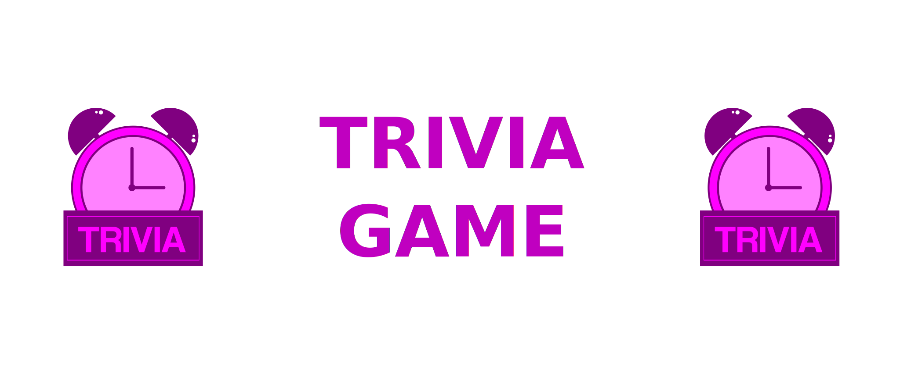

<p align="center">
  

  
  
  <a href="https://github.com/MuriloGon/trivia-game/commits/master">
    
  </a>

  

  <a href="https://github.com/MuriloGon/trivia-game/stargazers">
    
  </a>
</p>
<h1 align="center">
    
</h1>

<h2 align="center"> 
	🏬 Trivia Game
</h2>

<p align="center">
  <a href="#about-the-project">About the project</a>
  <a href="#functionalities">Functionalities</a>
  <a href="#screenshots">Screenshots</a>
  <a href="#installation-and-usage">Installation and Usage</a>
  <a href="#tech-and-framework-used">Tech/Framework used</a>
  <a href="#author">Author</a>
  <a href="#license">License</a>
</p>

## About the project

**Trivia Game** It's' a quiz game based on the Trivia game (like a Who Wants to Be a Millionaire) using React and Redux, developing its functionalities in groups according to the demands defined in a Kanban board.

> Project developed at Trybe on Frontend Module. Trybe is a web development school that has a genuine commitment to the professional success of its students. There are more than 1500 hours of training that covers fundamentals of web development, development, front-end, back-end, computer science, software engineering, agile methodologies and soft skills.

---

## Functionalities

- [x] Log in to the game and, if the email is registered on the Gravatar website, have your photo associated with the user's profile.
- [x] Access the page referring to the game, where you must choose one of the answers available for each of the questions presented. The answer must be marked before the timer reaches zero, otherwise the answer must be considered wrong.
- [x] Be redirected, after 5 answered questions, to the score screen, where the text shown depends on the number of correct answers.
- [x] View the ranking page, if you like, at the end of each game.
- [x] Configure some options for the game in a configuration screen accessible from the app header.

## Screenshots

The mockups are available on Figma:

<a href="https://www.figma.com/file/f3eela21tPA3ctNsTjeHrN/Mockups-Trivia">
  
</a>

<table>
  <tr>
    <td></td>
    <td></td>
    <td></td>
  </tr>
  <tr>
    <td></td>
    <td></td>
    <td></td>
  </tr>
 </table>

https://user-images.githubusercontent.com/45644220/138668690-bdf50faf-0d06-4728-afe7-12a229197d3f.mp4

---

## Installation and Usage

> Install depedencies

```bash
npm install
```

> Start server at localhost:3000 (default)

```bash
npm start
```

## Tech and Framework used

The following tools were used on this project:

#### **Libs**

- [NodeJS](https://nodejs.org/en/)
- [React](https://reactjs.org/)
- [React Router Dom](https://github.com/ReactTraining/react-router/tree/master/packages/react-router-dom)
- [React Transition Group](https://reactcommunity.org/react-transition-group/)
- [Styled components](https://styled-components.com/)
- [Reduxjs/toolkit](https://redux-toolkit.js.org/)

#### **Utilities**

- Mockups: [Figma](https://www.figma.com/)
- Text Editor: [Visual Studio Code](https://code.visualstudio.com/)
- Conventiona lCommit: [Conventional commit](https://github.com/conventional-changelog/commitlint)
- API Debug: [Insomnia](https://insomnia.rest/)

---

## Author

<a href="https://www.linkedin.com/in/MuriloGon/">
  
  <br />
  <sub>
    <b>Murilo Gonçalves</b>
  </sub>
</a>
<br>
<a href="https://www.linkedin.com/in/MuriloGon/">
  
</a>
<a href="mailto:murilogoncalvesdev@gmail.com" target="__blank">
  
</a>

---

## 📝 License

This project is under MIT License [MIT](./LICENSE).

Made by Murilo Gonçalves [Contact Me](https://www.linkedin.com/in/MuriloGon/)
